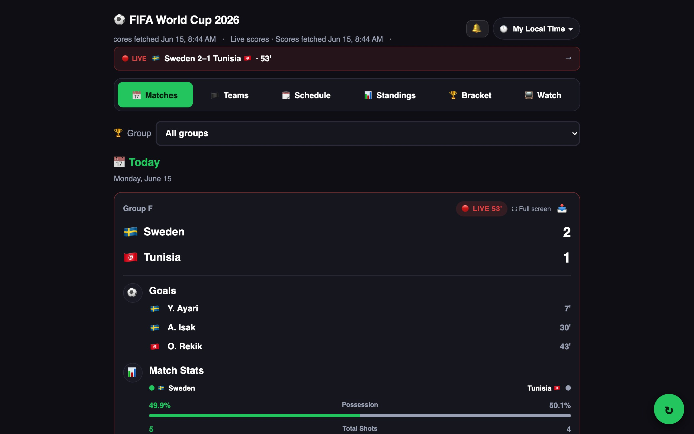
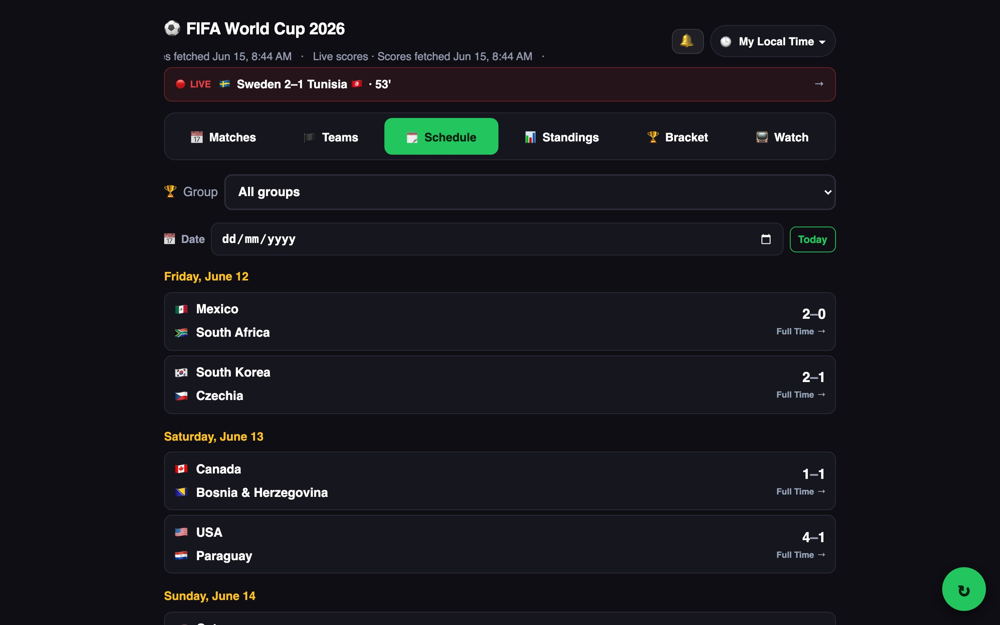
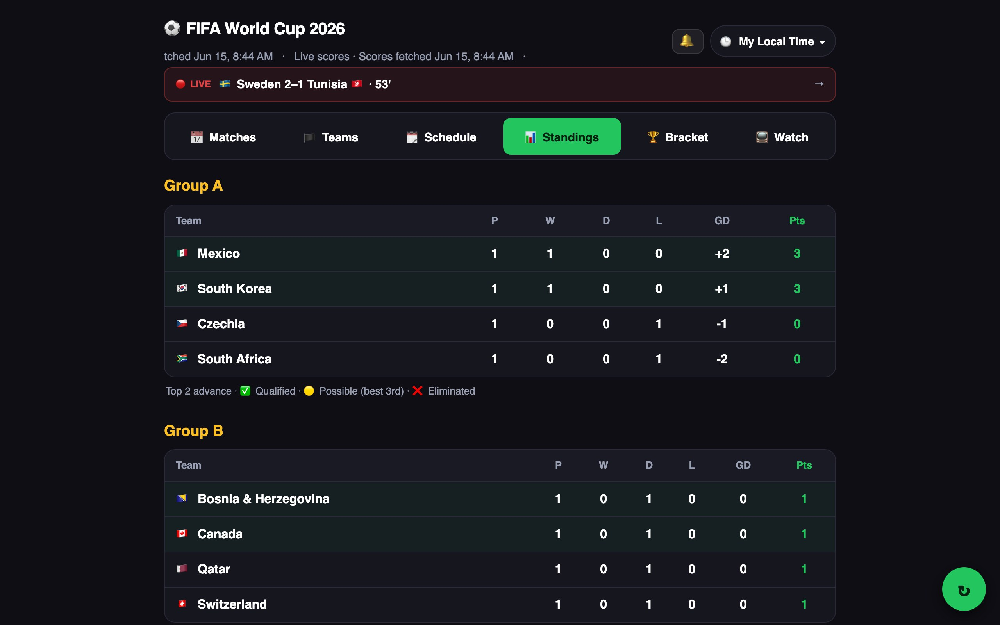
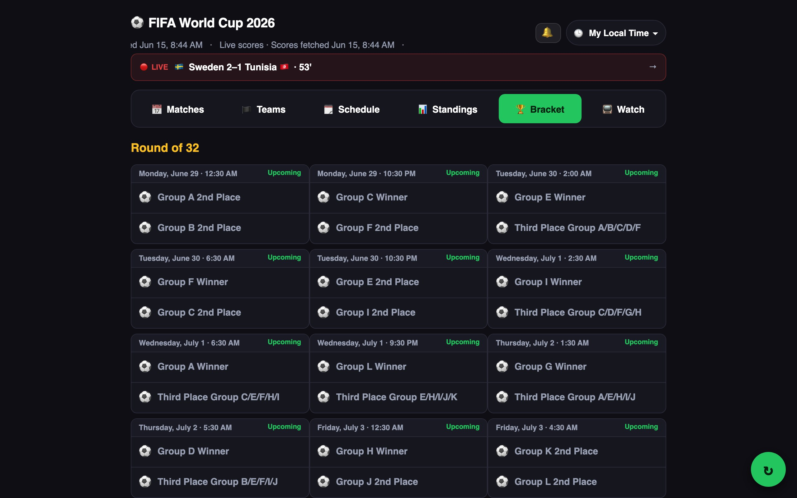
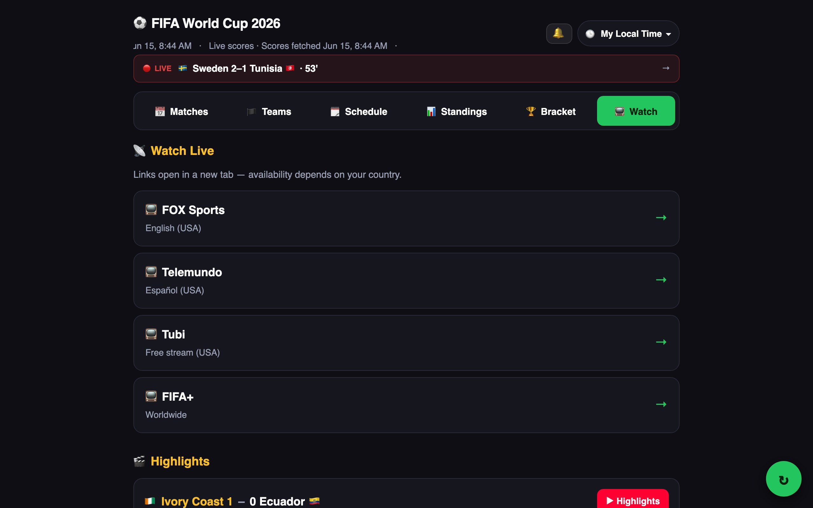
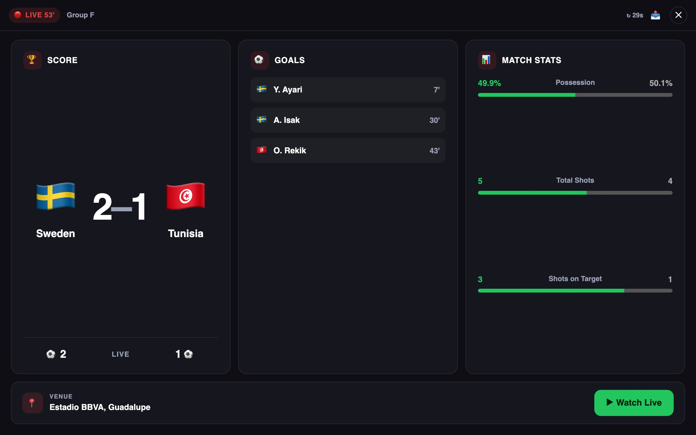
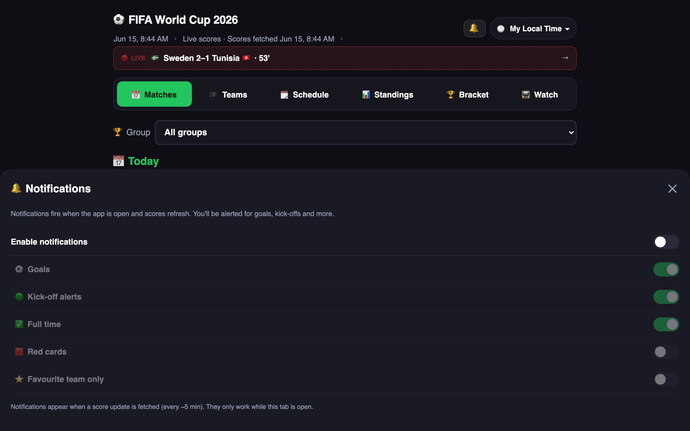
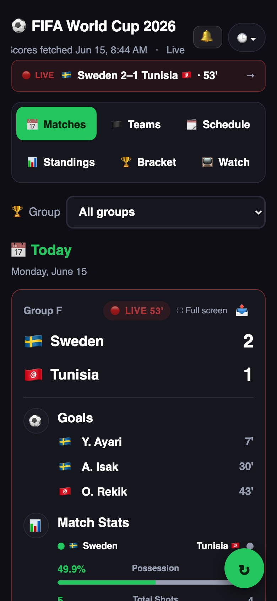
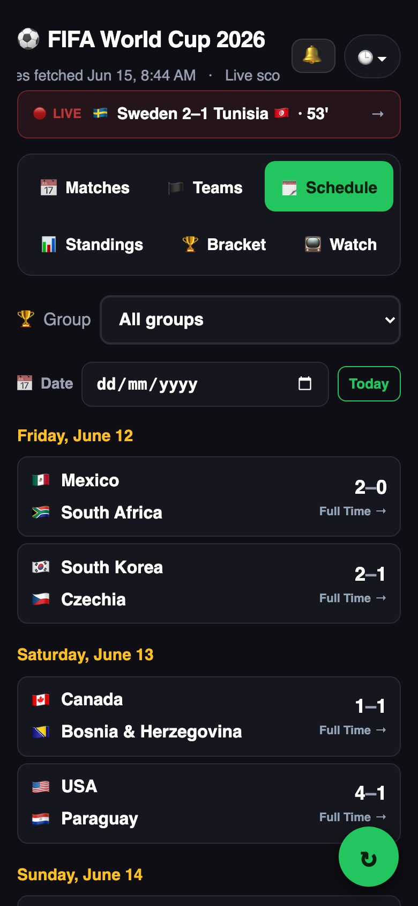
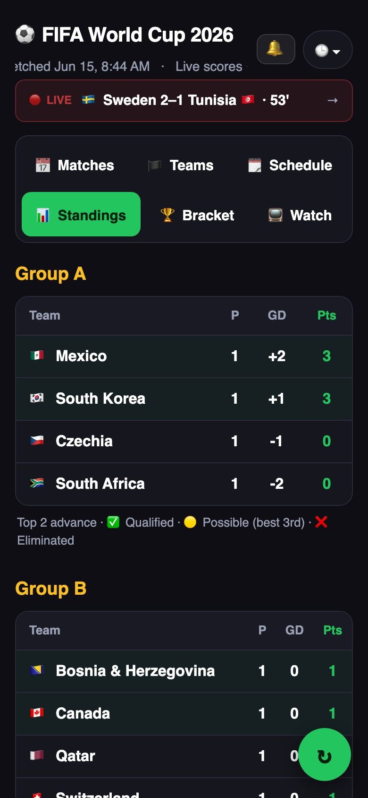

# ⚽ FIFA World Cup 2026 — Live Scores

A zero-API-token live scores progressive web app (PWA) for the 2026 FIFA World Cup.  
Scores refresh automatically every ~5 minutes via a scheduled GitHub Action. No login, no account, no ads.

**Live site → [fifa.shammas.in](https://fifa.shammas.in)**

---

## Table of Contents

- [Features](#features)
- [Screenshots](#screenshots)
  - [Matches](#matches)
  - [Schedule](#schedule)
  - [Standings](#standings)
  - [Knockout Bracket](#knockout-bracket)
  - [Watch & Highlights](#watch--highlights)
  - [Fullscreen Match View](#fullscreen-match-view-desktop--tablet)
  - [Notifications](#notifications)
  - [Mobile](#mobile)
- [Install as an App (PWA)](#install-as-an-app-pwa)
  - [iOS (Safari)](#ios-safari)
  - [Android (Chrome)](#android-chrome)
  - [Desktop (Chrome / Edge)](#desktop-chrome--edge)
- [How Scores Update](#how-scores-update)
- [Local Development](#local-development)

---

## Features

| Feature | Details |
|---|---|
| 🔴 Live scores | Scores, goals, cards, live minute — all from ESPN |
| 📅 Full schedule | All 104 matches, group stage through final |
| 📊 Group standings | Auto-calculated from results, with qualification indicators |
| 🏆 Knockout bracket | Round of 32 → Final |
| 📺 Watch links | Streaming providers + YouTube highlights |
| 🌍 Timezone picker | See all kick-off times in your local timezone |
| 🔔 Notifications | Browser alerts for goals, kick-offs, full time, red cards |
| 🔮 Score predictor | Predict scorelines and earn points |
| 📱 PWA / installable | Works offline, installs to home screen |
| ♻️ Auto-refresh | Data re-fetched every ~5 min — no manual refresh needed |

---

## Screenshots

### Matches

The default view. Live matches show at the top with a red border, real-time goals, match stats and a **Full screen** button. Finished matches expand with goals, stats, an ESPN recap and a **Watch Highlights** link. Upcoming matches show a countdown and a **+Calendar** button.



---

### Schedule

Full fixture list from June 12 to July 19. Filter by group or jump to any date with the date picker. Click any completed or live row to jump straight to its card in the Matches tab.



---

### Standings

Live group tables computed from all played results. Each table shows P / W / D / L / GD / Pts. A legend indicates which teams have qualified, are in contention for a best-third spot, or are eliminated.



---

### Knockout Bracket

Visual bracket from the Round of 32 through the Final, updating as teams advance.



---

### Watch & Highlights

Links to streaming providers for your region (availability varies by country) plus a scrollable list of YouTube highlight links for every finished match.



---

### Fullscreen Match View (Desktop / Tablet)

On screens ≥ 768 px wide, tapping **Full screen** on a live card opens an immersive three-panel view that fills the entire display:

| Panel | Content |
|---|---|
| **Score** | Large flags, score, team names, cards summary (🟨🟥), status bar |
| **Goals** | Chronological list of goals and cards with minute stamps |
| **Match Stats** | Possession, shots, saves, corners and more with progress bars |

A pinned bottom bar shows the venue and a **Watch Live** link. Data refreshes every 30 seconds without exiting fullscreen.



---

### Notifications

Tap the 🔔 bell to open notification settings. Grant browser permission once, then choose which events to be alerted about — all while the tab is open.

| Setting | Default | Description |
|---|---|---|
| Goals | ✅ On | Alert on every goal |
| Kick-off alerts | ✅ On | Alert when a match goes live |
| Full time | ✅ On | Alert at the final whistle |
| Red cards | Off | Alert on red cards |
| Favourite team only | Off | Restrict alerts to your starred team |



> Notifications fire when scores are fetched (~every 5 minutes) while this tab is open. They do not require a service worker or push subscription.

---

### Mobile

The app is fully responsive. On phones the navigation wraps to two rows and match cards stack vertically. The fullscreen modal uses a single-column layout sized for the screen.

<table>
<tr>
<td></td>
<td></td>
<td></td>
</tr>
<tr>
<td align="center">Matches</td>
<td align="center">Schedule</td>
<td align="center">Standings</td>
</tr>
</table>

---

## Install as an App (PWA)

Installing adds the app to your home screen / taskbar and lets it open without a browser address bar. It also caches assets for offline viewing.

### iOS (Safari)

1. Open **[fifa.shammas.in](https://fifa.shammas.in)** in **Safari** — must be Safari; Chrome on iOS does not support PWA install.
2. Tap the **Share** button (box with arrow pointing up) in the bottom toolbar.
3. Scroll down and tap **Add to Home Screen**.
4. Give it a name (or keep the default) and tap **Add**.
5. The app icon appears on your home screen. Tap it to open in full-screen mode.

---

### Android (Chrome)

1. Open **[fifa.shammas.in](https://fifa.shammas.in)** in **Chrome**.
2. Tap the three-dot menu (⋮) in the top-right corner.
3. Tap **Add to Home screen** (or **Install app** if Chrome shows a banner at the bottom).
4. Tap **Add** / **Install** in the confirmation dialog.
5. The app appears on your home screen and in the app drawer.

---

### Desktop (Chrome / Edge)

1. Open **[fifa.shammas.in](https://fifa.shammas.in)** in Chrome or Edge.
2. Look for the **install icon** in the address bar on the right side:
   - **Chrome:** click the ⊕ icon → **Install**.
   - **Edge:** click **…** menu → **Apps** → **Install this site as an app**.
3. The app opens in its own window without a browser address bar.
4. Find it in Start Menu / Launchpad like any other app.

---

## How Scores Update

```
GitHub Action (every 5 min)
       │
       ▼
fetch-scores.mjs  ──▶  ESPN public API  (no key required)
       │
       ▼
src/data/matches.json  (committed to repo)
       │
       ▼
deploy.yml  ──▶  Vite build  ──▶  GitHub Pages
       │
       ▼
Your browser loads the latest bundle  (scores baked in at build time)
```

- **Source:** ESPN's public scoreboard API — zero API tokens, zero secrets.
- **Frequency:** Every 5 minutes (configurable in `.github/workflows/fetch-scores.yml`).
- **Fallback:** If ESPN is unreachable, the scraper falls back to Wikipedia match tables.
- **No runtime calls:** Your browser never hits any external API. All data is baked into the static JS bundle at deploy time.

---

## Local Development

```bash
# Install dependencies
npm install

# Start dev server  →  http://localhost:5173
npm run dev

# Manually refresh match data
npm run fetch-scores

# Production build
npm run build
```

### Project structure

```
fifa2026/
├── src/
│   ├── main.jsx              # Entire React app
│   └── data/
│       └── matches.json      # Auto-updated match data
├── scripts/
│   └── fetch-scores.mjs      # ESPN scraper
├── .github/workflows/
│   ├── fetch-scores.yml      # Scheduled score fetcher (every 5 min)
│   └── deploy.yml            # GitHub Pages deploy
├── public/
│   ├── sw.js                 # Service worker (PWA / offline)
│   └── manifest.json         # PWA manifest
└── docs/
    └── screenshots/          # App screenshots used in this README
```

### Deploying your own copy

1. Fork this repo.
2. Go to **Settings → Pages → Source** and select **GitHub Actions**.
3. Push any commit — the deploy workflow runs automatically.
4. Your site will be live at `https://<your-username>.github.io/fifa2026/`.
5. Optional: set a custom domain in Settings → Pages and add a DNS CNAME pointing to `<your-username>.github.io`.

---

**Built by [Shammas Oliyath](https://shammas.in)** · Data & recaps powered by [ESPN](https://www.espn.com) · Hosted on GitHub Pages · v1.0
